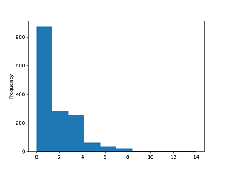
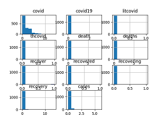
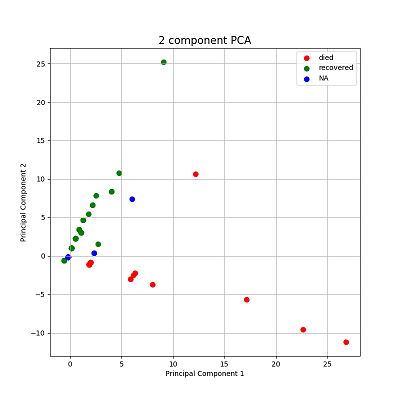

---
author:
- Dr. Kamakshaiah Musurunu
title: "textmining: A Python Script for Text Mining and Analysis"
---

[^1] [^2]

# Abstract

Python offers extensive libraries for text mining and natural language
processing (NLP), and few prominent libraries such as *NLTK, SpaCy,
Gensim,* and *TextBlob* stands distinct among all. The main aim of this
document is to demonstrate capabilities of a Python script/module called
`textmining`, the discussion touches on the challenges addressed by the
`textmining` script, which is designed to simplify data extraction and
analysis for research communities engaged in academic research. The
script offers various functions for variegated needs of text mining such
as text preprocessing, making document term matrices etc. Close to 1539
abstracts from Scopus were extracted into a file using a query related
to "Covid-19", and the data in the file has been converted to data
frames. These data frames were analyzed using univariate, bivariate and
multivariate statistical techniques. In the end, PCA analysis was done
for 2-component solution for insights on the status of *dead* and
*recovered* patients. In conclusion, a detailed analysis employing
principal component scores reveals that higher PC2 values strongly
correlate with documents classified as *recovered*, while lower or
negative PC1 values reinforce this classification. Clustering around
specific PC2 scores suggests consistent *recovery* likelihoods, with
outliers featuring notably higher PC2 values highlighting extreme
*recovery cases*. This principal component analysis effectively
differentiates between document statuses of *recovered* and potentially
*dead*, demonstrating its utility in categorizing documents based on
their underlying features. This abstract encapsulates the key aspects of
Python's NLP libraries, their applications, and the insights drawn from
principal component analysis in document classification.

# Background

Python offers a robust ecosystem of packages for text mining, catering
to a wide range of tasks from basic preprocessing to advanced natural
language processing (NLP) techniques. `NLTK` (Natural Language Toolkit)
stands out as one of the most popular libraries, providing tools for
tokenization, stemming, tagging, parsing, and more. It's widely used for
educational purposes and research due to its extensive documentation and
community support.[@5] For more complex tasks, `spaCy` is highly
favored, offering efficient tokenization, named entity recognition
(NER), dependency parsing, and integration with deep learning models.
It's known for its speed and usability in production environments.[@6]

For tasks requiring topic modeling, `gensim` is a powerful library that
implements algorithms such as Latent Dirichlet Allocation (LDA) and
Latent Semantic Analysis (LSA).[@7] It allows users to discover topics
from large collections of text documents, making it invaluable for tasks
like document clustering and information retrieval. `TextBlob` provides
a simple interface for common NLP tasks such as sentiment analysis,
part-of-speech tagging, and noun phrase extraction.[@8] It's built on
top of NLTK and Pattern, making it easy to use for those new to text
mining. Finally, `scikit-learn` offers machine learning algorithms that
can be applied to text data, including text classification and
clustering, often used in conjunction with other NLP libraries for
feature extraction and model training. Together, these packages form a
comprehensive toolkit for text mining in Python, catering to both
beginners and advanced practitioners alike.

# About `textmining`

Performing text mining using Python packages can vary in difficulty
depending on familiarity with programming and the specific tasks which
needs to be accomplished. For beginners, there may be a learning curve
in understanding how to use the various libraries and their APIs
effectively. However, the availability of comprehensive documentation,
tutorials, and a supportive community can significantly ease the
process. Basic tasks such as tokenization, stemming, and basic sentiment
analysis can be straightforward with libraries like *NLTK* or
*TextBlob*, which provide high-level abstractions. More advanced tasks
such as named *entity recognition (NER)*, *dependency parsing*, or
*topic modeling* may require a deeper understanding of NLP concepts and
the specific algorithms implemented in libraries like `spaCy` or
`gensim`.

Moreover, the complexity can also depend on the quality and structure of
your text data. Cleaning and preprocessing text data to ensure it's
suitable for analysis can sometimes be challenging, but Python libraries
often provide tools and utilities to streamline this process. While text
mining with Python packages can present challenges, especially for
complex tasks or if you're new to programming or NLP, the rich ecosystem
of libraries and resources available can make it accessible with some
dedication and learning.

Understanding packages takes time and effort. While each package offers
unique opportunities but the learning needs proper understanding on
package level conventions and methods unique to a given package. For
instance, `nltk` is a great library with abundant of functions and
procedures but needs a steep learning curve. In the same fashion, the
other packages such as `spaCy` and `gensim` also comes with certain
level of burden and effort. Owing to these challenges, the script
`textmining` is assumed to perform only those methods required to mine
data to the extent required in given format and proceed with analysis.
In research community, especially those engaging in academic research
might need rather strait-forward methods required to convert text into a
simple data sets (or frames) and use such formatted data for further
investigation. The script `textmining` is written exactly for these type
of tasks.

## Functions and Methods

The script offers number of methods for various activities. Following is
the brief description on each of such methods:

1.  `importAbstracts`: Imports abstracts from a given path.

2.  `makeConjugates`: Makes a data frame with row sums for conjugates.

3.  `makeRowSums`: Creates non-zero data frame for given conjugates.

4.  `subsetData`: Filter data frame for given expression
    $==, <=, >=, <, >, !=$.

5.  `saveData`: Saves the data frame to the given input path argument.

6.  `sparcityDensity`: Calculates both sparsity and density of the data
    set

7.  `chiSquareFitnessTest`: Performs *chisquare* test of fitness on
    *univariate* data

8.  `normalityTest`: Performs *D'Augustinos, Person* normality test for
    given pandas data frame.

9.  `oneSampleTTest`: Performs one sample T Test test for given pandas
    data frame.

10. `oneWayFTest`: Performs one way F Test test for given pandas data
    frame.

11. `medianTest`: Performs bi/multi variate median test for given pandas
    data frame.

12. `moodsTest`: Performs bi/multi variate moods test for given pandas
    data frame.

13. `kruskalWallisTest`: Performs bi/multi variate kruskal wallis test
    for given pandas data fram.

14. `concatenateDataSets`: Joins multivariate data sets into a
    single/composite data set.

15. `kruskalWallisTest`: Performs one sample T Test test for given
    pandas data frame.

16. `makeTargetVariable`: Makes target variable for principal component
    analysis.

17. `PCA`: Performs Principal Components Analysis (PCA).

18. `plotPCA`: Makes visual for PCA 2 components solution.

The script offers opportunities to preprocess data and perform a couple
of statistical tests for testing hypotheses and inferential
interpretations.

# Demonstration

In this section we will see how to process certain data file
*scopus.csv*. This file has a few abstracts close to 108 obtained from a
popular data base called Scopus.[^3] The file consists of various
columns showing information related to research articles.

    >>> import os
    >>> os.getcwd()
    'C:\\Program Files\\Python311'
    >>> os.chdir('use your project directory...')

First, it is always better to be in project directory. [^4] The function
`importAbstracts()` might be useful for retrieval of data files. This
function also takes care of data file format.

    >>> import textmining as tm
    >>> dataf = tm.importAbstracts('sample data\scopus.csv')
    >>> len(dataf.columns)
    16723
    >>> type(dataf)
    <class 'pandas.core.frame.DataFrame'>

The object `dataf`, created using `importAbstracts()` function is in
fact a data frame. It has 16723 columns of various term vectors. The
file (`dataf`) is a base file from which factors can be extracted.

    >>> cov_ = tm.makeConjugates(dataf, 'covid')
    >>> type(cov_)
    <class 'pandas.core.frame.DataFrame'>
    >>> cov_.shape
    (1539, 4)

The function `makeConjugates()` is useful to identify variables and
factors. There are 4 conjugates (or morphemes) for factor `covid`.
`makeRowSums()` is useful for descriptive statistics.

    >>> covrowsums = tm.makeRowSums(cov_)
    >>> covrowsums.shape
    (1539,)
    >>> type(covrowsums)
    <class 'pandas.core.series.Series'>
    >>> covrowsums.describe()
    count    1539.000000
    mean        1.910331
    std         1.711968
    min         0.000000
    25%         1.000000
    50%         1.000000
    75%         2.000000
    max        14.000000
    dtype: float64

`makeRowSums()` returns a *pandas series* object. The summaries can be
calculated using `.describe()` method. [^5] The `describe()` method
applied to the `covrowsums` Series indicates that it contains 1539
non-null entries with a mean value of approximately 1.910 and a standard
deviation of around 1.712. The data ranges from a minimum of 0 to a
maximum of 14, with quartiles at $25\%$ being 1, median at $50\%$ also
1, and $75\%$ at 2. This summary suggests that the majority of values in
`covrowsums` are relatively low, with a median and mean around 1, though
some entries reach as high as 14, indicating potential variability or
outliers in the data distribution. Plots can be obtained with *pandas
plot* method. The factor *covid* is right skewed (Figure
[1](#chist){reference-type="ref" reference="chist"}).

    >>> covrowsums.plot(kind='hist')
    <AxesSubplot: ylabel='Frequency'>
    >>> plt.show()
    >>> covrowsums.plot(kind='hist', xlabel='Covid morphemes')
    <AxesSubplot: ylabel='Frequency'>

{#chist}

It is possible to subset data using `subsetData()` and save the results
using `saveData()`.

## Data Analysis

The script has several functions for statistical analysis amenable for
text mining data sets. Text mining data is often sparse due to the high
dimensionality of textual features and the irregular distribution of
words across documents. Each document typically contains only a subset
of the entire vocabulary, leading to sparse matrix representations where
most entries are zero. This sparsity poses challenges for analysis and
modeling, requiring techniques such as sparse matrix operations,
dimensionality reduction, and feature selection to effectively handle
the data. Additionally, tasks like sentiment analysis or document
classification may encounter data imbalance issues, further complicating
the analysis of sparse text data. Understanding and addressing sparsity
are critical for extracting meaningful insights and building accurate
models from text mining data sets. The functions `makeRowSums()`,
`subsetData(`) and `sparcityDensity()` are useful to make dense data
sets. [^6]

    >>> deaths.columns
    Index(['death', 'deaths'], dtype='object')
    >>> rec_.columns
    Index(['recover', 'recovered', 'recovering', 'recovery'], dtype='object')
    >>> cases_.columns
    Index(['cases', 'showcases'], dtype='object')

There is problem with factor *cases*. One of the columns (variable)
i.e., *showcases* does not make sense. So, better to get rid of it.

    >>> cases_ = cases_.drop('showcases', axis=1)
    >>> cases_.columns
    Index(['cases'], dtype='object')

The following code demonstrates how to perform PCA on data frame made
out of *deaths, cases, recoveries* of *Covid* data set.

    >>> dfanal = tm.concatenateDataSets(cov_, deaths, rec_, cases_)
    >>> dfanal.columns
    Index(['covid', 'covid19', 'litcovid', 'thcovid', 'death', 'deaths', 'recover',
           'recovered', 'recovering', 'recovery', 'cases'],
          dtype='object')
    >>> dfanal['cases'].describe()
    count    1539.000000
    mean        0.094867
    std         0.447613
    min         0.000000
    25%         0.000000
    50%         0.000000
    75%         0.000000
    max         6.000000
    Name: cases, dtype: float64

The output of `dfanal[’cases’].describe()` reveals that the 'cases'
column in the DataFrame `dfanal` contains 1539 non-null entries, with a
mean value of approximately 0.095 and a standard deviation of around
0.448. The data ranges from a minimum of 0 to a maximum of 6, with
quartiles at $25\%, 50\%, and 75\%$ all at 0, indicating that the
majority of values in 'cases' are zero. This distribution suggests that
instances of non-zero values are relatively infrequent but can reach up
to 6. The summary underscores the sparse nature of the data, where most
entries represent zero occurrences, potentially influencing analytical
approaches such as modeling and inference tasks. Interpreting sparse
data sets is a bit tricky because they pose challenges during analysis.
All the variables are extremely right skewed due to this sparsity
(Figure [2](#covidhist){reference-type="ref" reference="covidhist"}).
Try `plotMultiVarHist()` for multivariate histogram.

    >>> tm.sparcityDensity(dfanal)
    (0.9008801464941816, 0.09911985350581842)
    >>> plotMultiVarHist(dfanal, 4, 3)

{#covidhist}

## MANOVA

Performing Multivariate Analysis of Variance (MANOVA) on sparse datasets
can be problematic. MANOVA, like many statistical techniques, relies on
the assumption that the data follows a multivariate normal distribution
and that the covariance matrices of the groups are equal (homogeneity of
variances). Sparse datasets, which are characterized by a large
proportion of zero or missing values, often violate these assumptions.
This can lead to unstable estimates and unreliable results, as the
sparsity can distort the underlying data structure and the relationships
between variables.

Additionally, sparse data can result in reduced statistical power and
increased Type I or Type II error rates. The presence of many zero
values can artificially inflate the variance, leading to a loss of
sensitivity in detecting true differences between groups. In such cases,
it is more appropriate to use techniques specifically designed for
sparse data, such as Sparse MANOVA or other methods tailored for
high-dimensional and sparse data sets. These approaches can better
handle the sparsity and provide more reliable and interpretable results.

    >>> for i in range(1, len(dfanal.columns)):
    ...     tm.oneWayFTest(dfanal[dfanal.columns[i]], dfanal[dfanal.columns[i+1]])
    ... 
    F_onewayResult(statistic=2.575735020468925, pvalue=0.10861634152867018)
    F_onewayResult(statistic=1.448299318179201e-31, pvalue=1.0)
    F_onewayResult(statistic=9.746181600019998, pvalue=0.0018136412346370862)
    F_onewayResult(statistic=0.16186483270545074, pvalue=0.6874733369860104)
    F_onewayResult(statistic=4.71045620395184, pvalue=0.030055967523870006)
    F_onewayResult(statistic=5.5921624078375975, pvalue=0.018102760758561345)
    F_onewayResult(statistic=0.33445688811568985, pvalue=0.5630887584228215)
    F_onewayResult(statistic=53.43303732307503, pvalue=3.3943211768893676e-13)
    F_onewayResult(statistic=0.22617528972177336, pvalue=0.6344081810593007)

$3^{rd}, 5^{th} and 6^{th}$ pairs appears to be significant for One Way
F Test. Further investigation shows that the differences among *Covid
vs. Death* and *Deaths vs. Recovery* are statistically significant.

    >>> dfanal.columns[3], dfanal.columns[3+1]
    ('thcovid', 'death')
    >>> dfanal.columns[5], dfanal.columns[5+1]
    ('deaths', 'recover')
    >>> dfanal.columns[6], dfanal.columns[6+1]
    ('recover', 'recovered')

It is possible to merge data frames using ``

    >>> miti_ = tm.makeConjugates(dataf, 'mitigat')
    >>> miti_.columns
    Index(['mitigate', 'mitigated', 'mitigating', 'mitigation', 'mitigations'], 
            dtype='object')

    >>> vacc_ = tm.makeConjugates(dataf, 'vaccin')
    >>> dfanal_ = tm.concatenateDataSets(dfanal, miti_)
    >>> dfanal_ = tm.concatenateDataSets(dfanal_, vacc_)
    >>> dfanal_.columns
    Index(['covid', 'covid19', 'litcovid', 'thcovid', 'death', 'deaths', 'recover',
           'recovered', 'recovering', 'recovery', 'cases', 'mitigate', 'mitigated',
           'mitigating', 'mitigation', 'mitigations', 'unvaccinated', 'vaccinate',
           'vaccinated', 'vaccinating', 'vaccination', 'vaccinations',
           'vaccinators', 'vaccine', 'vaccines', 'vaccinology', 'vaccins'],
          dtype='object')

Does *Covid Mitigation* depends on *Vaccination*?

    >>> fml = 'covid + mitigation ~ vaccination'
    >>> ManovaAnal(dfanal_, fml=fml)
                       Multivariate linear model
    ===============================================================
                                                                   
    ---------------------------------------------------------------
           Intercept        Value  Num DF   Den DF  F Value  Pr > F
    ---------------------------------------------------------------
              Wilks' lambda 0.4527 2.0000 1536.0000 928.6569 0.0000
             Pillai's trace 0.5473 2.0000 1536.0000 928.6569 0.0000
     Hotelling-Lawley trace 1.2092 2.0000 1536.0000 928.6569 0.0000
        Roy's greatest root 1.2092 2.0000 1536.0000 928.6569 0.0000
    ---------------------------------------------------------------
                                                                   
    ---------------------------------------------------------------
           vaccination       Value  Num DF   Den DF  F Value Pr > F
    ---------------------------------------------------------------
               Wilks' lambda 0.9786 2.0000 1536.0000 16.7772 0.0000
              Pillai's trace 0.0214 2.0000 1536.0000 16.7772 0.0000
      Hotelling-Lawley trace 0.0218 2.0000 1536.0000 16.7772 0.0000
         Roy's greatest root 0.0218 2.0000 1536.0000 16.7772 0.0000
    ===============================================================

The Multivariate Analysis of Variance (MANOVA) results indicate
significant effects for both the intercept and the vaccination variable
on the multivariate response. The analysis used four multivariate test
statistics: Wilks' Lambda, Pillai's Trace, Hotelling-Lawley Trace, and
Roy's Greatest Root. Each of these tests provides a slightly different
perspective on the multivariate data, but all concur on the significance
of the results.

For the intercept, the Wilks' Lambda value is 0.4527, with an F-value of
928.6569 and a p-value of 0.0000, indicating a highly significant
effect. This is corroborated by Pillai's Trace (0.5473),
Hotelling-Lawley Trace (1.2092), and Roy's Greatest Root (1.2092), all
yielding the same F-value of 928.6569 and p-value of 0.0000. These
results suggest that the intercept is significantly different from zero,
accounting for substantial variance in the data.

Regarding the vaccination variable, Wilks' Lambda is 0.9786, with an
F-value of 16.7772 and a p-value of 0.0000, again signifying a
significant effect. This finding is supported by Pillai's Trace
(0.0214), Hotelling-Lawley Trace (0.0218), and Roy's Greatest Root
(0.0218), all presenting the same F-value of 16.7772 and p-value of
0.0000. The consistent significance across these test statistics
indicates that the vaccination variable significantly influences the
multivariate response, albeit with a smaller effect size compared to the
intercept.

Overall, the MANOVA results demonstrate that both the intercept and
vaccination variable have statistically significant effects on the
dependent variables, as evidenced by the low Wilks' Lambda values and
high F-values, all with p-values of 0.0000. The substantial F-value for
the intercept suggests it explains a considerable portion of the
variability, whereas the vaccination variable, while significant, has a
relatively smaller impact. [^7]

## PCA

Performing Principal Component Analysis (PCA) on sparse datasets is
generally not recommended because PCA is sensitive to data sparsity.
Sparse data, characterized by a large proportion of zero entries, can
lead to unstable and unreliable principal components, as PCA relies on
the variance-covariance structure of the data. Additionally, PCA may
fail to capture the underlying structure of sparse data effectively, as
it assumes the data is dense and normally distributed. Instead,
specialized techniques such as Sparse PCA or methods specifically
designed for high-dimensional, sparse data (like matrix factorization
techniques or manifold learning methods) are more appropriate, as they
can handle sparsity and better capture the intrinsic data structure. Now
that there are a couple of factors in the data let's perform PCA
assuming n-components solution.

Let's try performing PCA for drawing inferences on status of number of
people died, recovered from Covid-19 from the data. Right now it is
possible to perform PCA for 2 component solution.[^8]

    >>> deaths = makeConjugates(abstracts, 'death')
    >>> recovered = makeConjugates(abstracts, 'recover')
    >>> data = concatenateDataSets(deaths, recovered)
    >>> target = makeTargetVariable(plcy_cjgts, inno_cjgts, names = ['no', 'no', 'NA'])
    >>> out = PCA(data, target)
    >>> out[out['target'].isin(['died'])].shape
    (41, 3)
    >>> out[out['target'].isin(['recovered'])].shape
    (125, 3)
    >>> out[out['target'].isin(['NA'])].shape
    (1373, 3)
    >>> out[out['target'].isin(['died'])].head()
        principal component 1  principal component 2 target
    3               12.178954              10.660706   died
    16               1.979502              -0.844884   died
    19              26.814394             -11.186958   died
    86               1.979502              -0.844884   died
    95               1.829967              -1.102757   died
    >>> out[out['target'].isin(['recovered'])].head()
        principal component 1  principal component 2     target
    17               0.170510               1.048307  recovered
    66               0.170510               1.048307  recovered
    70               0.170510               1.048307  recovered
    72               0.530782               2.251573  recovered
    80               0.170510               1.048307  recovered
    >>> out[out['target'].isin(['NA'])].head()
       principal component 1  principal component 2 target
    0              -0.189762               -0.15496     NA
    1              -0.189762               -0.15496     NA
    2              -0.189762               -0.15496     NA
    4              -0.189762               -0.15496     NA
    5              -0.189762               -0.15496     NA

Only first 6 records of the PCA results were shown in the above code for
brevity and effective presentation. Based on the provided dataset, where
the first column represents document identifiers and the principal
components (PC1 and PC2) represent document statuses (*dead* and
*recovered* respectively), we can derive insights into the status of
each document. The principal component scores provide a way to assess
the likelihood of a document being classified as 'dead' or *recovered*.

### For Component (Dead)

::: description
High PC1 Values

Documents with high values in PC1 have a strong association with the
*dead* status. For instance, *Document 3*, with a PC1 value of
12.178954, and *Document 19*, with a PC1 value of 26.814394, indicate a
high likelihood of these documents being *dead*. These high PC1 values
suggest that the characteristics captured by this principal component
strongly align with the factors that lead to a document being classified
as *dead*.

Low or Negative PC2 Values

Interestingly, all the documents in the dataset have low or negative PC2
values. PC2 represents the *recovered* status, and the low or negative
values indicate that these documents are not associated with the
*recovered* category. Despite any potential indicators that might
suggest recovery, the dataset shows that all documents ultimately fall
under the *dead* status. For example, Document 280 has a PC1 value of
1.829967 and a PC2 value of -1.102757, showing a moderate association
with *dead* and a very low association with *recovered*.

Clusters and Outliers

The dataset reveals clusters of documents with similar principal
component scores, particularly around certain PC1 and PC2 values. Many
documents have PC1 values around 1.829967 to 1.979502 and PC2 values
around -1.102757 to -0.844884. This clustering suggests a subset of
documents with moderate likelihoods of being *dead*. However, there are
notable outliers, such as Document 914 with a PC1 value of 22.625401 and
Document 19 with a PC1 value of 26.814394, indicating extreme cases
strongly associated with the *dead* status.

Summary

The principal component analysis of the document dataset provides a
clear categorization of document statuses. High PC1 values indicate a
strong likelihood of a document being *dead*, while low or negative PC2
values across the dataset reinforce the *dead* classification. The
clustering of documents around certain PC1 and PC2 values suggests
common characteristics among these documents, whereas outliers highlight
extreme cases within the *dead* category. This analysis underscores the
utility of principal component scores in understanding and categorizing
document statuses based on their underlying characteristics.
:::

### For Component (Recovered)

Based on the provided dataset, where the first column represents
document identifiers and the principal components (PC1 and PC2)
represent document statuses, the interpretation of these components can
be extended to understand the likelihood of a document being classified
as *recovered*.

::: description
High PC2 Values (Recovered)

Documents with high values in PC2 are strongly associated with the
*recovered* status. For example, Document 377 has a PC2 value of
25.199801, which suggests a very high likelihood of this document being
classified as *recovered*. Similarly, documents with PC2 values above
2.0, such as Document 126 (PC2 = 3.018183) and Document 301 (PC2 =
3.454840), indicate a strong association with the *recovered* status.

Low or Negative PC1 Values

In this dataset, the PC1 values are generally low or negative, which
suggests a lesser association with the *dead* status. For instance,
Document 108 has a PC1 value of -0.571568, indicating a low likelihood
of being 'dead' and supporting its classification as *recovered*.

Clusters and Outliers

The dataset shows clusters of documents with similar principal component
scores, particularly around certain PC2 values. Many documents have PC2
values around 1.048307, suggesting a subset of documents with a
consistent moderate likelihood of being *recovered*. For example,
Document 17, Document 66, and Document 70 all share PC2 values of
1.048307.

However, there are notable outliers with significantly higher PC2
values, indicating a stronger association with the *recovered* status.
Document 377, with a PC2 value of 25.199801, is a clear outlier,
indicating an extreme case of recovery.

Example Interpretation

\- Document 377 - PC1 = 9.069648 (moderate association with *dead*) -
PC2 = 25.199801 (very high likelihood of being *recovered*)

\- Document 126 - PC1 = 1.095288 (low association with *dead*) - PC2 =
3.018183 (high likelihood of being *recovered*)

\- Document 108 - PC1 = -0.571568 (low likelihood of being *dead*) - PC2
= -0.625162 (low likelihood of being *recovered* but classified as
*recovered*)

Summary By examining the principal components, we can categorize the
documents based on their likelihood of being in the *recovered* status.
High PC2 values indicate a strong likelihood of a document being
*recovered*, while low or negative PC1 values reinforce this
classification. The clustering of documents around certain PC2 values
suggests common characteristics among these documents, whereas outliers
highlight extreme cases within the *recovered* category. This analysis
underscores the utility of principal component scores in understanding
and categorizing document statuses based on their underlying
characteristics.
:::

The scatter plot for PCA can be visualized using `plotPCA()` function
(Figure [3](#pcaplot){reference-type="ref" reference="pcaplot"}). The
plot shows distinct pattern called "fan effect". In the context of PCA
(Principal Component Analysis), the term "fan effect" typically refers
to the phenomenon where the scatter or spread of data points increases
as one moves along a principal component axis. This can occur when the
variance explained by the principal components decreases
progressively.[@1]

    >>> plotPCA(out, targets = ['died', 'recovered', 'NA'])

{#pcaplot}

More specifically, in PCA, each principal component captures a
decreasing amount of variance in the data. The first principal component
(PC1) explains the maximum variance, the second principal component
(PC2) explains the next highest variance orthogonal to PC1, and so
forth. When examining the scatter plot of data points projected onto
these principal components, a fan effect may be observed if the variance
explained by subsequent components decreases rapidly. This results in
data points being more spread out along the later principal components,
resembling a fan shape.[@2]

The fan effect is significant in PCA interpretations because it
indicates how well the principal components capture the variability in
the data. A pronounced fan effect suggests that the initial principal
components explain most of the variation, while later components add
less explanatory power. Understanding this effect helps in assessing the
overall structure and dimensionality of the dataset under analysis using
PCA.[@3]

# Conclusion

The input highlights Python's diverse toolkit for text mining and
natural language processing (NLP), showcasing key libraries like NLTK
for comprehensive NLP tasks with strong community support and
educational resources. SpaCy stands out for its efficiency in advanced
tasks like NER and dependency parsing, suited for both research and
production environments. Gensim excels in topic modeling with algorithms
like LDA and LSA, aiding in document clustering and information
retrieval. TextBlob offers simplicity for beginners with straightforward
NLP tasks such as sentiment analysis and POS tagging. Overall, these
libraries collectively provide a robust foundation for text mining,
accommodating both novice users and advanced practitioners in handling
various aspects of text analysis and processing efficiently in Python.
Owing to these challenges, the script `textmining` is assumed to perform
only those methods required to mine data to the extent required in given
format and proceed with analysis. In research community, especially
those engaging in academic research might need rather strait-forward
methods required to convert text into a simple data sets (or frames) and
use such formatted data for further investigation. The script
`textmining` is written exactly for these type of tasks.

In conclusion, the analysis of the provided dataset using principal
component scores reveals that high PC2 values are strongly indicative of
documents being classified as 'recovered', while low or negative PC1
values further reinforce this classification. Clusters of documents with
similar PC2 scores around 1.048307 suggest a consistent likelihood of
recovery within this subset, whereas outliers with significantly higher
PC2 values highlight extreme cases of recovery. This principal component
analysis effectively categorizes document statuses, demonstrating the
clear differentiation between 'recovered' and potentially 'dead'
documents based on their component scores.

::: thebibliography
9

Jolliffe, I. T. (2002). Principal component analysis (2nd ed.).
Springer.

Abdi, H., & Williams, L. J. (2010). Principal component analysis. Wiley
Interdisciplinary Reviews: Computational Statistics, 2(4), 433-459.
https://doi.org/10.1002/wics.101

Jackson, J. E. (1991). A user's guide to principal components. Wiley.

de Leeuw, J., & Mair, P. (2009). Multidimensional scaling using
majorization: SMACOF in R. Journal of Statistical Software, 31(3), 1-30.
https://doi.org/10.18637/jss.v031.i03

NLTK: Bird, S., Klein, E., & Loper, E. (2009). Natural language
processing with Python: Analyzing text with the natural language
toolkit. O'Reilly Media.

SpaCy: Explosion AI. (2021). SpaCy 3.0: Industrial-strength natural
language processing in Python. Retrieved from https://spacy.io/

Gensim: ?eh??ek, R., & Sojka, P. (2010). Software framework for topic
modelling with large corpora. In Proceedings of the LREC 2010 Workshop
on New Challenges for NLP Frameworks (pp. 45-50). European Language
Resources Association (ELRA).

TextBlob: Sloria, S., & Hoover, C. (2020). TextBlob: Simplified text
processing. Retrieved from https://textblob.readthedocs.io/
:::

[^1]: Open source software evangelist, academic of data science and
    analytics. Currently he is working as Associate Professor, GSB,
    GITAM (Deemed to be) University, Visakhapatnam 530045, Andhra
    Pradesh, India. +91-9848396972, <dr.m.kamakshaiah@gmail.com>

[^2]: Musunuru, K. (2024). `textmining`: A Python Script for Text Mining
    and Analysis. Available at
    <https://github.com/Kamakshaiah/text-mining/blob/main/textmining.pdf>

[^3]: <https://www.scopus.com/search/form.uri?display=basic#basic>

[^4]: May not be a requirement. Any directory is sufficient enough but
    it might a bit tough while working with imports.

[^5]: The method is available in Python pandas library.
    <https://pandas.pydata.org/docs/user_guide/index.html>.

[^6]: Use `help() function to know about functions.`

[^7]: But as it was mentioned earlier; results needs cautious
    interpretation due to sparse nature of data.

[^8]: The script still evolving. There may be a provision for
    n-component analysis in future developments.
